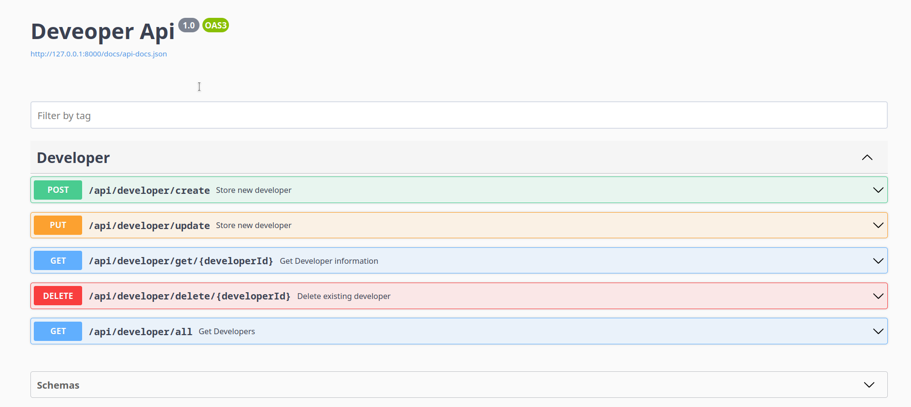

# reference-architecture

1. docker-compose up -d -> podize kontejner sa postgres bazom podataka
2. kreirati bazu employment
3. composer install
4. cp .env.example .env
5. php artisan optimize
6. php artisan doctrine:generate:proxies
7. php artisan doctrine:schema:create
8. php artisan l5-swagger:generate -> generise open.api fajl
9. http://127.0.0.1:8000/api/documentation -> url do swagger page-a
10. Slika ispod je swagger page odakle mozete da izvrsavate crud
    

1. Api controller - App\Http\Controllers\Api\DeveloperController
2. Api rute - web/routes/api.php
3. Registrovani interfejsi - App\Providers\AppServiceProvider
4. Ugovori izmedju framwrork-a i poslovne logike - Architecture\Api\Contracts
5. Implementacija applikativnih servisa - Architecture\ApplicationServices\DeveloperService
6. Domen (entiteti, interfejsi repozitorijuma i infra servisa) - Architecture\Domain
7. Infrastruktura(infra servisi, repozitorijumi) - Architecture\Infrastructure

